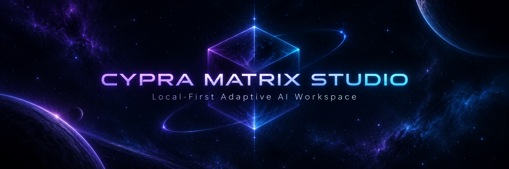
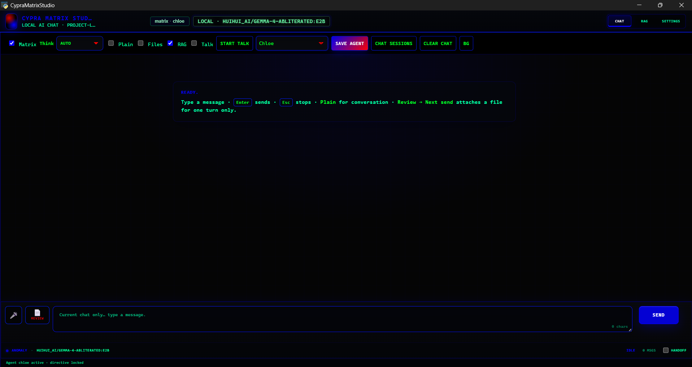
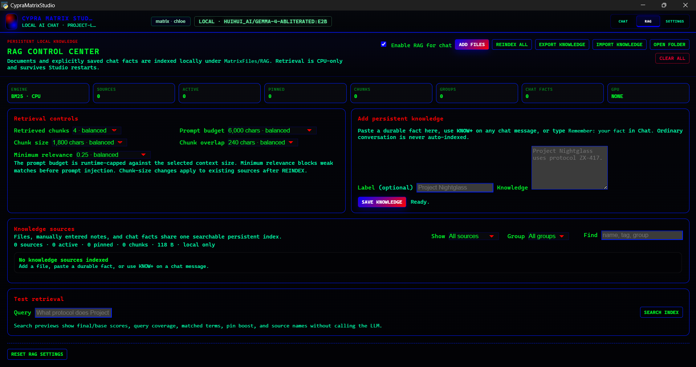

# Cypra Matrix Studio

<p align="center">
  
</p>

Cypra Matrix Studio is a local-first Windows AI workspace built around project-local Ollama models. It provides local chat, a persistent Matrix specialist system, configurable reasoning modes, local RAG knowledge, file review, isolated agent file workplaces, voice/TTS, session persistence, and runtime controls.

**Current baseline:** `1.1.15-files-consent-hardening-20260904`

---

## Overview

| Area | Implementation |
| --- | --- |
| Local inference | Ollama over loopback |
| Matrix specialists | 700 agents across groups |
| Reasoning modes | `OFF`, `AUTO`, `STANDARD`, `DEEP` |
| RAG retrieval | CPU-based BM25 |
| Persistent knowledge | `MatrixFiles/RAG/` |
| Agent file access | Isolated to `MatrixFiles/Workplaces/<agent>/` |
| File review | Explicitly selected local files |
| Context settings | 8K to 256K |
| Voice | Local Piper with optional Edge TTS |
| Sessions | Persistent local chat sessions |
| UI modes | Classic and Modern |
| Configuration | Project-relative, portable storage |

## Starting Studio

On Windows, use:

```bat
START.bat
```

or:

```powershell
powershell.exe -NoProfile -ExecutionPolicy Bypass -File .\START.ps1
```

The launcher:

1. Resolves paths relative to the Studio directory.
2. Prepares or uses the supported Python environment.
3. Starts the local Studio server.
4. Connects to the project-local Ollama runtime and model store.
5. Opens the desktop UI or configured browser mode.

Models are pulled only when the user explicitly starts a model pull.

---

## Core Components

### Chat

Chat is the primary model interaction surface.

<p align="center">
  
</p>

<p align="center"><sub>Chat workspace with Matrix agent selection, adaptive Think control, RAG, Files, voice controls, sessions, and local model status.</sub></p>

Available functions include:

- Matrix agent selection
- streamed model responses
- response cancellation
- current-session conversation history
- saved chat sessions
- persistent Think mode selection
- optional Think stream display
- optional RAG retrieval
- optional agent file-workplace access
- local file review
- voice/TTS
- generation diagnostics
- RAG source provenance on grounded responses

### Matrix Specialists

Studio includes **700 project-local Matrix specialists organized into 77 groups**.

Each specialist uses a project-local directive and can be selected from Chat. Agent configuration is saved so the selected specialist and related settings can persist across restarts.

### Adaptive Think Control

Think mode controls generation behavior rather than only changing whether reasoning output is visible.

| Mode | Behavior |
| --- | --- |
| `OFF` | Direct response path with minimal reasoning overhead |
| `AUTO` | Resolves each turn to an appropriate reasoning level |
| `STANDARD` | Deliberate reasoning for normal complex work |
| `DEEP` | Stronger reasoning path for difficult audits, debugging, architecture, and multi-step work |

The selected mode remains active until changed. Chat and Settings stay synchronized.

`Show think stream` is a separate display preference. Hiding the stream does not disable reasoning.

When the loaded Ollama model exposes native thinking support, Studio uses the supported native request behavior. Unsupported models fall back to prompt-directed reasoning without changing permissions or context size.

---

## RAG Knowledge System

Persistent RAG data is stored under:

```text
MatrixFiles/RAG/
```

The default retrieval engine is **BM25 on CPU**. It does not require a separate embedding model and does not add another model to GPU residency.

### Adding Knowledge

Knowledge can enter RAG through:

- **Add Files** in the RAG workspace
- **ADD TO RAG** from Review File
- manually entered persistent knowledge
- **KNOW+** on a user or assistant message
- explicit commands such as `Remember: ...`

Normal conversation is **not automatically indexed**.

### RAG Control Center

The RAG Control Center provides a dedicated interface for managing persistent local knowledge, retrieval behavior, indexing, and source organization.

<p align="center">
  
</p>

<p align="center"><sub>RAG Control Center with BM25 CPU retrieval, source management, retrieval tuning, persistent knowledge entry, import/export, and retrieval testing.</sub></p>

The RAG Control Center supports:

- enable/disable without deleting a source
- pin/unpin priority
- labels
- groups
- tags
- source preview
- source type, size, and chunk metadata
- duplicate-content detection
- per-source reindexing
- full reindexing
- minimum relevance thresholds
- retrieval diagnostics
- source filters
- source removal
- separate RAG knowledge export/import

Retrieved context is bounded against the selected model context size before generation.

---

## File Handling

Studio separates **file review**, **persistent RAG knowledge**, and **agent file operations**. These are independent capabilities.

### Review File

Review File works only with a file explicitly selected by the user.

A selected file can be:

- reviewed with the active model
- copied
- inserted into the current composer
- queued for the next send
- added directly to persistent RAG with **ADD TO RAG**

Reviewing a file does not automatically add it to persistent knowledge.

Direct RAG ingestion does not require a model review first.

The local extraction path supports the existing text/source formats and Review-compatible document handling such as PDF, DOCX, and XLSX when available in the local environment.

### Agent File Workplaces

The **Files** capability does not provide general disk or source-tree access.

Each Matrix agent is restricted to its own workplace:

```text
MatrixFiles/Workplaces/<agent>/
```

File operations require explicit current-turn user intent. Mentioning a filename alone does not authorize a read, write, rename, delete, or directory listing operation.

Examples of explicit operations:

```text
Read notes.txt
Update notes.txt with the corrected values
List the files in this workplace
Delete old.txt
```

Hypothetical, negated, unrelated, or model-invented file operations are rejected. Path-containment, size, and per-agent isolation checks remain in force.

---

## Runtime and Storage

Core inference uses Ollama over loopback.

Typical project-relative locations:

| Resource | Default location |
| --- | --- |
| Model store | `OllamaModels/` |
| Matrix directives / Modelfiles | `MatrixFiles/Modfiles/` or detected Matrix root |
| Agent file workplaces | `MatrixFiles/Workplaces/<agent>/` |
| RAG knowledge | `MatrixFiles/RAG/` |
| Exported config / knowledge bundles | `MatrixFiles/Exports/` |
| Runtime data | `data/` |
| Chat sessions | `data/sessions/` |
| Logs | `data/launch.log`, `data/server.log` |

The Studio server binds to `127.0.0.1` by default instead of exposing the application service to the LAN.

### Context Size

Context size is a persistent runtime setting.

Available values:

```text
8K → 16K → 32K → 64K → 128K → 256K
```

For supported chat paths, the selected value is passed to Ollama through `options.num_ctx`.

RAG prompt injection is bounded separately so retrieved material cannot consume the entire configured context window.

---

## Voice and TTS

Local TTS uses project-local Piper assets when available.

Optional Edge TTS is disabled unless explicitly enabled. It is the primary voice feature that can require an outbound speech request.

`STOP VOICE` cancels active synthesis and playback. Provider changes also stop stale playback.

See [SECURITY.md](SECURITY.md) for network and privacy boundaries.

---

## Appearance

Studio provides two independent UI modes:

- **Classic** — original Matrix Studio visual language
- **Modern** — cleaner spacing, softer surfaces, refined typography, and reduced visual noise

UI mode is separate from the selected color theme. Changes apply live and persist across restart and configuration export/import.

---

## Portable Use

Cypra Matrix Studio is designed around project-relative storage.

Do not hard-code another machine's:

- Windows user profile
- Python installation path
- model-store path

If a copied `.venv` references Python from another machine, remove only the broken environment and allow the launcher to rebuild it from the supported local Python installation.

New configuration should use `CYPRA_*` environment variable names.

---

## Configuration and Knowledge Export

Configuration export/import preserves supported Studio settings while avoiding credential leakage.

The normal configuration bundle does **not** contain RAG document contents. RAG knowledge uses a separate explicit export/import bundle so private or large knowledge stores are not silently included in a settings backup.

---

## Security Boundaries

Cypra Matrix Studio is a local AI application with explicit capability boundaries. It is **not an operating-system security sandbox**.

Current boundaries include:

- Studio HTTP traffic is loopback-only by default.
- Non-loopback Host/Origin requests are rejected by the server layer.
- Review File reads only a file explicitly selected by the user.
- Agent Files access is limited to the selected agent's workplace and requires explicit operation intent.
- RAG ingestion is explicit; normal chat is not silently persisted as knowledge.
- Retrieved RAG text is treated as evidence rather than higher-priority system instructions.
- Plugins are executable code and should be treated as trusted code.
- Configuration exports exclude private provider credentials.
- Model pulls and optional online TTS are deliberate outbound-network actions.
- Destructive or reset actions should remain confirmation-gated where applicable.

See [SECURITY.md](SECURITY.md) for additional security information.

---

## Architecture

```text
                         Cypra Matrix Studio
                                │
        ┌───────────────────────┼────────────────────────┐
        │                       │                        │
       Chat                    RAG                    Settings
        │                       │                        │
  Matrix agents         Persistent knowledge     Runtime / Models
  Adaptive Think        BM25 CPU retrieval       AI / Chat / Voice
  Sessions              Source manager           Appearance
  Review File           Provenance               App & Data
  Files capability      Knowledge bundles        Plugins
        │                       │
        ├──── Review → optional Add to RAG ──────┤
        │                       │
        └──── Grounded context returned to Chat ─┘
```

---

## Validation

Common source checks:

```powershell
python -m pytest -q
node --check static/js/app.js
node --check static/js/themes.js
node --check static/js/voice.js
node tests/test_voice_stop.js
```

Python sources can also be compiled without launching the desktop runtime:

```powershell
python -m compileall app.py server.py engine tts
```

---

## Repository Hygiene

Do not commit:

- model weights
- API credentials
- `.env` secrets
- private chat or session data
- local logs
- private RAG knowledge
- private agent workplaces
- copied virtual environments

---

## License

[MIT License](LICENSE)
